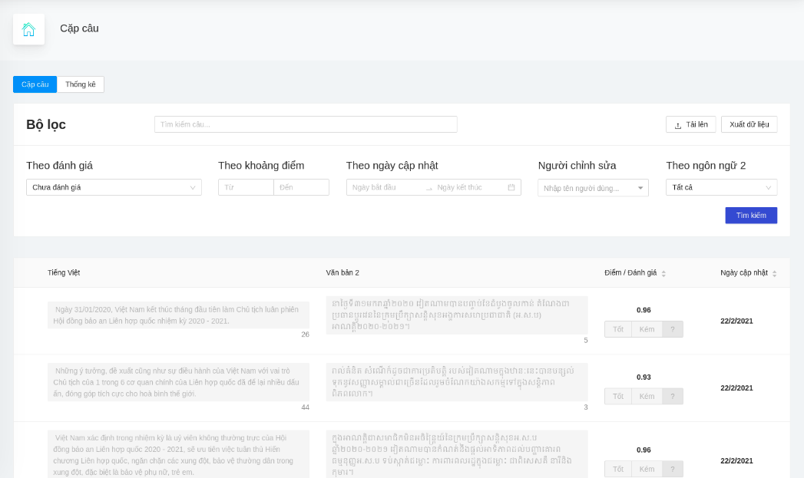

<div id="top"></div>
<!--
*** Thanks for checking out the Best-README-Template. If you have a suggestion
*** that would make this better, please fork the repo and create a pull request
*** or simply open an issue with the tag "enhancement".
*** Don't forget to give the project a star!
*** Thanks again! Now go create something AMAZING! :D
-->


<!-- PROJECT SHIELDS -->
<!--
*** I'm using markdown "reference style" links for readability.
*** Reference links are enclosed in brackets [ ] instead of parentheses ( ).
*** See the bottom of this document for the declaration of the reference variables
*** for contributors-url, forks-url, etc. This is an optional, concise syntax you may use.
*** https://www.markdownguide.org/basic-syntax/#reference-style-links
-->
[![Contributors][contributors-shield]][contributors-url]
[![Forks][forks-shield]][forks-url]
[![Stargazers][stars-shield]][stars-url]
[![Issues][issues-shield]][issues-url]
[![MIT License][license-shield]][license-url]
[![LinkedIn][linkedin-shield]][linkedin-url]


<!-- PROJECT LOGO -->
<br />
<div align="center">
    <a href="https://github.com/KCDichDaNgu/KC4.0_Data_Tools">
        
    </a>

  <h3 align="center">KC4.0 dịch đa ngữ (Công cụ làm dữ liệu)</h3>

  <p align="center">
    Tài liệu mô tả chi tiết cách cài đặt, sử dụng phần mềm KC4.0 dịch đa ngữ (Công cụ làm dữ liệu)
    <br />
    <a href="https://github.com/KCDichDaNgu/KC4.0_Data_Tools"><strong>Chi tiết tài liệu »</strong></a>
    <br />
    <br />
    <!-- <a href="https://github.com/KCDichDaNgu/KC4.0_Data_Tools">View Demo</a>
    · -->
    <a href="https://github.com/KCDichDaNgu/KC4.0_Data_Tools/issues">Báo cáo lỗi</a>
    ·
    <a href="https://github.com/KCDichDaNgu/KC4.0_Data_Tools/issues">Yêu cầu tính năng</a>
  </p>
</div>


<!-- TABLE OF CONTENTS -->
<details>
    <summary>Mục lục</summary>
    <ol>
        <li>
            <a href="#giới-thiệu">Giới thiệu</a>
            <ul>
                <li><a href="#công-nghệ">Công nghệ</a></li>
            </ul>
        </li>
        <li>
            <a href="#bắt-đầu">Bắt đầu</a>
            <ul>
                <li><a href="#điều-kiện">Điều kiện</a></li>
                <li><a href="#cài-đặt">Cài đặt</a></li>
            </ul>
        </li>
        <li><a href="#sử-dụng">Sử dụng</a></li>
        <!-- <li><a href="#roadmap">Roadmap</a></li> -->
        <li><a href="#đóng-góp">Đóng góp</a></li>
        <li><a href="#giấy-phép">Giấy phép</a></li>
        <li><a href="#liên-hệ">Liên hệ</a></li>
        <!-- <li><a href="#acknowledgments">Acknowledgments</a></li> -->
    </ol>
</details>


<!-- ABOUT THE PROJECT -->
## Giới thiệu

<br/>



<br/>
<br/>

Dự án này là một phần của hệ thống <strong>KC4.0 dịch đa ngữ</strong>, đóng vai trò hỗ trợ quá trình làm dữ liệu song ngữ. Chi tiết hơn, một số chức năng quan trọng của hệ thống có 
thể kể đến như:
*   Đánh giá, chỉnh sửa cặp câu song ngữ 
*   Đánh giá, chỉnh sửa cặp văn bản song ngữ
*   Nhập, xuất dữ liệu
*   Xem thống kê báo cáo
*   Quản lý người dùng hệ thống

<p align="right">(<a href="#top">Trở lại đầu trang</a>)</p>


### Công nghệ

Hệ thống được xây dựng dựa trên những công nghệ dưới đây

*   [NodeJS](https://nodejs.org/)
*   [Flask](https://flask.palletsprojects.com/)
*   [MongoDB](https://www.mongodb.com/)

<p align="right">(<a href="#top">Trở lại đầu trang</a>)</p>


<!-- GETTING STARTED -->
## Bắt đầu

### Điều kiện

Trước khi cài đặt hệ thống, đảm bảo môi trường được thiết lập như sau:
*   Ubuntu 20.04 (Khuyến khích)
*   Python phiên bản >= 3.8 (Khuyến khích)
*   MongoDB phiên bản >= 4.0
*   Nodejs
*   Virtualenv

Dưới đây là những bước chi tiết để cài đặt hệ thống
*   Cài đặt [Python](https://docs.python-guide.org/starting/install3/linux/) 
*   Cài đặt NodeJS
    ```sh
    curl -o- https://raw.githubusercontent.com/nvm-sh/nvm/v0.39.1/install.sh | bash
    ```
    ```sh
    export NVM_DIR="$([ -z "${XDG_CONFIG_HOME-}" ] && printf %s "${HOME}/.nvm" || printf %s "${XDG_CONFIG_HOME}/nvm")"
    ```
    ```sh
    [ -s "$NVM_DIR/nvm.sh" ] && \. "$NVM_DIR/nvm.sh" # This loads nvm
    ```
    ```sh
    nvm install --lts
    ```
    ```sh
    nvm use --lts
    ```
* Cài đặt [MongoDB](https://docs.mongodb.com/manual/tutorial/install-mongodb-on-ubuntu/)
* Cài đặt Virtualenv

    ```sh
    sudo apt install python3-pip # Nếu chưa có pip
    ```
    ```sh
    sudo apt install virtualenv
    ```

### Cài đặt

1.  Tải repo xuống
    ```sh
    git clone https://github.com/your_username_/KC4.0_Data_Tools
    ```
2.  Chuyển hướng vào thư mục của dự án
3.  Tạo môi trường ảo (trong thư mục dự án) 
    ```sh
    virtualenv ./.env
    ```
    ```sh
    source .venv/bin/activate
    ```
4.  Cài đặt các gói thư viện
    ```sh
    pip install -r requirements.txt
    ```
5.  Chuyển hướng vào thư mục server
6.  Chỉnh sửa các biến cần thiết trong tệp .env
    ```yaml
    BITEXTOR_PATH # Đường dẫn phần mềm gióng hàng
    BITEXTOR_DONE_PATH # Đường dẫn thư mục chứa kết quả gióng hàng, tạo thư mục nếu chưa có
    BITEXTOR_ERR_PATH # Đường dẫn thư mục chứa kết quả gióng hàng lỗi, tạo thư mục nếu chưa có
    BITEXTOR_LOG_PATH # Đường dẫn thư mục chứa kết quả log gióng hàng, tạo thư mục nếu chưa có
    TOKEN_CRAWL_API # Token api của công cụ thu thập dữ liệu
    ```
7.  Thêm dữ liệu ban đầu
    ```sh
    sudo systemctl start mongod # Nếu chưa chạy
    ```
    ```sh
    python3 seed_for_demo.py
    ```
8.  Chuyển hướng vào thư mục client
9.  Cài đặt các gói thư viện cần thiết

    ```sh
    npm i
    ```
10. Chỉnh sửa các biến môi trường trong tệp .env.development nếu cần thiết

<p align="right">(<a href="#top">Trở lại đầu trang</a>)</p>


<!-- USAGE EXAMPLES -->
## Sử dụng

<strong>(*)</strong> Cần kích hoạt môi trường ảo trước khi thực hiện

Để chạy hệ thống, thực hiện các bước sau:
1.  Chuyển hướng vào thư mục server
2.  Chạy câu lệnh 

    ```sh
    python3 app.py
    ```
    <strong>(*)</strong> Chú ý cần khởi động mongodb trước khi chạy
3.  Chuyển hướng vào thư mục client
4.  Chạy câu lệnh

    ```sh
    npm start
    ```

<p align="right">(<a href="#top">Trở lại đầu trang</a>)</p>


<!-- CONTRIBUTING -->
## Đóng góp

TODO

<p align="right">(<a href="#top">Trở lại đầu trang</a>)</p>


<!-- LICENSE -->
## Giấy phép

TODO

<!-- Distributed under the MIT License. See `LICENSE.txt` for more information. -->

<p align="right">(<a href="#top">Trở lại đầu trang</a>)</p>


<!-- CONTACT -->
## Liên hệ

TODO

<!-- Your Name - [@your_twitter](https://twitter.com/your_username) - email@example.com

Project Link: [https://github.com/your_username/repo_name](https://github.com/your_username/repo_name) -->

<p align="right">(<a href="#top">Trở lại đầu trang</a>)</p>


<!-- MARKDOWN LINKS & IMAGES -->
<!-- https://www.markdownguide.org/basic-syntax/#reference-style-links -->
[contributors-shield]: https://img.shields.io/github/contributors/othneildrew/Best-README-Template.svg?style=for-the-badge
[contributors-url]: https://github.com/KCDichDaNgu/KC4.0_Data_Tools/graphs/contributors
[forks-shield]: https://img.shields.io/github/forks/othneildrew/Best-README-Template.svg?style=for-the-badge
[forks-url]: https://github.com/KCDichDaNgu/KC4.0_Data_Tools/network/members
[stars-shield]: https://img.shields.io/github/stars/othneildrew/Best-README-Template.svg?style=for-the-badge
[stars-url]: https://github.com/KCDichDaNgu/KC4.0_Data_Tools/stargazers
[issues-shield]: https://img.shields.io/github/issues/othneildrew/Best-README-Template.svg?style=for-the-badge
[issues-url]: https://github.com/KCDichDaNgu/KC4.0_Data_Tools/issues
[license-shield]: https://img.shields.io/github/license/othneildrew/Best-README-Template.svg?style=for-the-badge
[license-url]: https://github.com/KCDichDaNgu/KC4.0_Data_Tools/blob/master/LICENSE.txt
[linkedin-shield]: https://img.shields.io/badge/-LinkedIn-black.svg?style=for-the-badge&logo=linkedin&colorB=555
[linkedin-url]: https://linkedin.com/in/othneildrew
[product-screenshot]: images/screenshot.png
